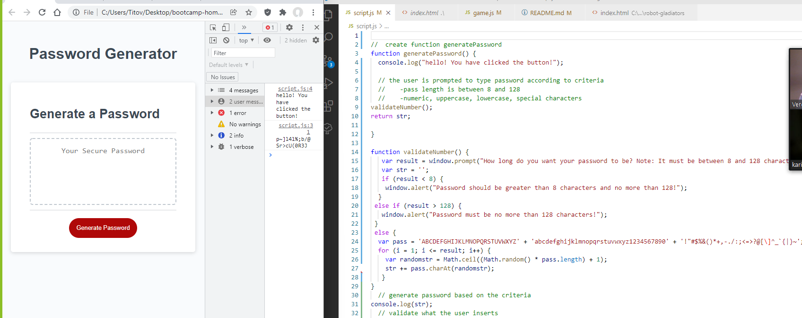
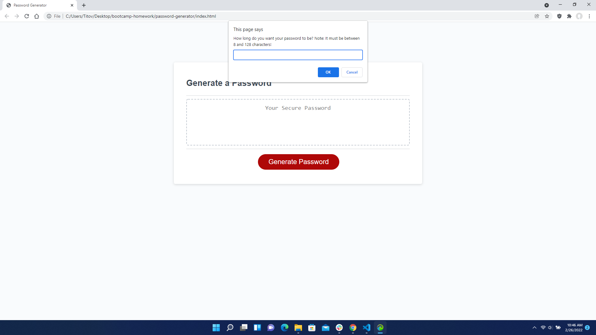
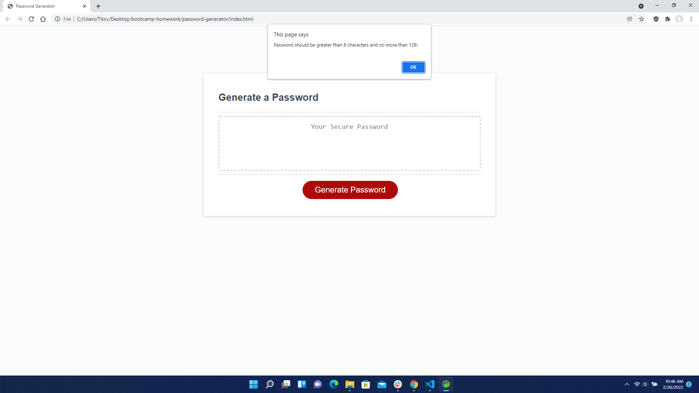
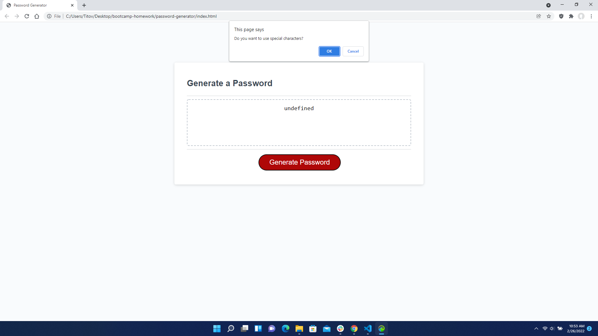

# Password Generator
## Purpose:
 * To create an application with JavaScript that contains a random password generator. 

  ## Table of Contents:
1. [ Description ](#desc)
2. [ Built With ](#built-with)
3. [ Steps ](#steps)
4. [ Link to my page ](#link-to-my-page)
5. [ Helpful Links ](#help)

## 1. Description
 * Any user can utilize this application to create their own unique, random passcode that meets certain criteria.
 * It will run in the browser.
 * When asked to enter a password length, the user types in the length number.
 * Other windows pop up prompting the user to choose whether or not to include uppercase, lowercase, numbers, and/or special characters.
 * Based on their response, the generator calculates and presents a random password meeting the criteria chosen.

## 2. Built With
 * CSS
 * HTML
 * JavsScript

 ## 3. Steps

  

  
   The user begins by clicking on the 'Generate Password' button. Automatically a window prompts them to choose how many characters they want their password to be.

  

  

  

  

  

  

  
  
  
  

 An issue that would/t allow the code to run was the incorrect placement of the _____ outside of the 'for' loop. Variables created within the curly braces of a function only exist within that function's braces. Any reference to it outside of the function will cause the program to break because it can't find a variable with that name. being outside of the 'for' loop kept only drawing random groups of two, one, and zero characters. Once I placed them inside of the 'for' loop

 ## 4. Link To Project in My Github Pages:[ My Password Generator]()

 ## 5. Helpful Links
  * [MDN Web Docs on JS:](https://developer.mozilla.org/en-US/docs/Web/JavaScript)
  * [Help on geeksforgeeks](https://www.geeksforgeeks.org/how-to-generate-a-random-password-using-javascript/)
  * [CharAt String on W3 Schools](https://www.w3schools.blog/charat-string-javascript)
  * [JavaScript Arrays](https://www.w3schools.com/js/js_arrays.asp)
  * 
  * 
  * 
  * 
 

