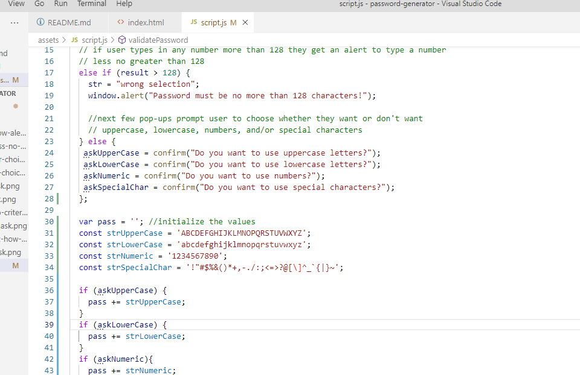
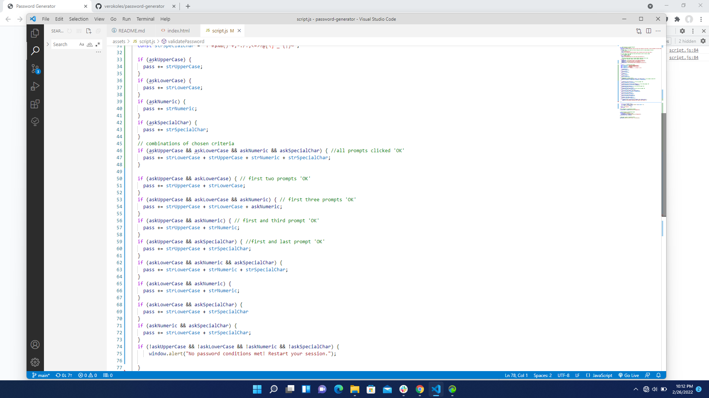
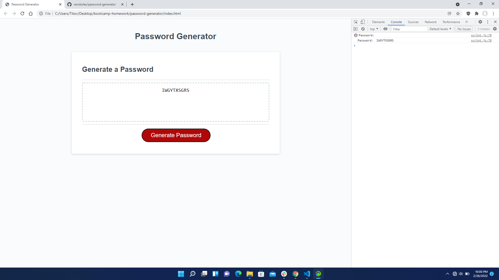
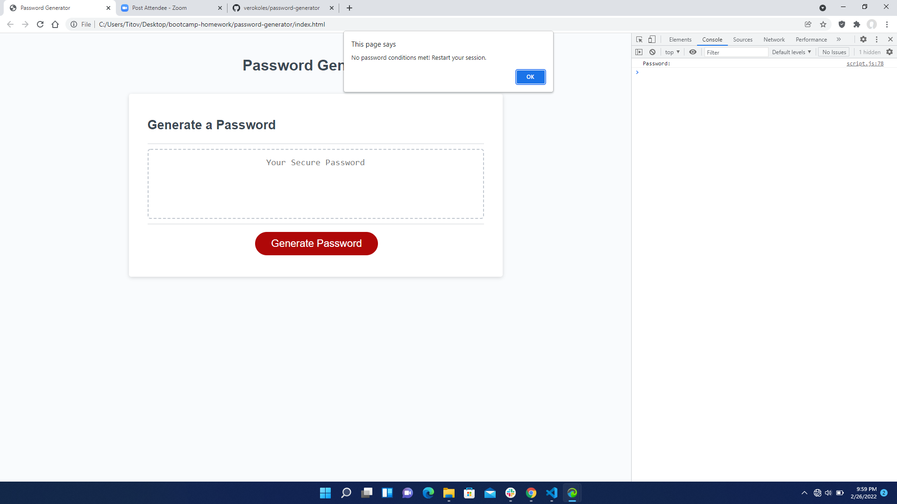
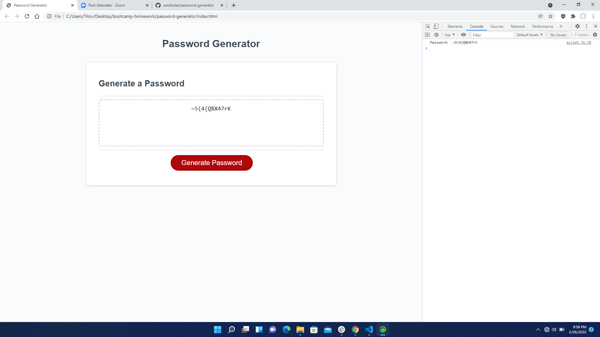
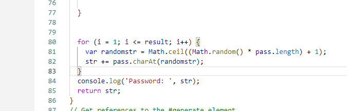

# Password Generator
## Purpose:
 * To create an application with JavaScript that contains a random password generator. 

  ## Table of Contents:
1. [ Description ](#desc)
2. [ Built With ](#built-with)
3. [ Steps ](#steps)
4. [ Link to my page ](#link-to-my-page)
5. [ Helpful Links ](#help)

## 1. Description
 * Any user can utilize this application to create their own unique, random passcode that meets certain criteria.
 * It will run in the browser.
 * When asked to enter a password length, the user types in the length number.
 * Other windows pop up prompting the user to choose whether or not to include uppercase, lowercase, numbers, and/or special characters.
 * Based on their response, the generator calculates and presents a random password meeting the criteria chosen.

## 2. Built With
 * CSS
 * HTML
 * JavsScript

 ## 3. Steps

  
      As a beginner in JavaScript, I decided to tackle what seemed to be the most challenging portion to to me- the math section.
      I wanted to make sure that once I have set up all my variables and functions, the actual random password would successfully generate for the user. 
      I started with a validateNumber function and the else { statement with 'var pass' equal to all the possible number and letter and character arrays.
      The pseudocode was obviously unorganzied and some extra statements scattared, but typing it in helped me focus on what I had to do next.
  

  
      The next line of code I focused on was the first pop-up window asking the user how many characters they'd like.
      I set var result = window.prompt("How long do you want your password to be? Note: It must be between 8 and 128 characters!");
      and the var string set to empty.
      The user begins by clicking on the 'Generate Password' button. 
      Automatically a window prompts them to choose how many characters they want their password to be, and they type in their response.

  
      Next, the variables set to constant jsut assigned arrays to the corresponding name.
      I later moved the arrays down to lines 30-34 in JS to help me set up the 'if' statements.
   

  
     If they were to choose 7 or lower, the window prompt would come back as incorrect and the window alert would ask them to choose a number between 8 and 128 again.
  

  
     Choosing a number 129 and above would prompt the alert for choosing a number no greater than 128. 
  

     The next few pop-ups prompt the user to choose whether they want or don't want
     uppercase, lowercase, numbers, and/or special characters. They simply choose 'OK' for yes and 'Cancel' for no.
     These quesstions are stored in the else{ statement as 'ask.-' statements corresponding the criteria questions.
     Then the 'confirm()' call creates the alerts asking the user what they'd like to include.

  

  

  

  

    The next lines of 'if (ask--)' statements in JS are the 16 different variations that come from the four different questions asked.
    The pass =+ statments mean that the preceding 'ask' statement makes the password include those characters.
    So if the 'ask.--' statements are true then the password includes something from the 'const str' array that it matches to (in simpler terms):
  
  

  
    I went through to check if only one of the criteria chosen would generate a password.
    Choosing true or  clicking 'OK' for JUST THE FIRST prompt, which is uppercase letters, but 'Cancel' for the rest actually generates a password with the length chosen! As shown, it generates a random string of only UPPERCASE letters.:
  

  
    On the other hand, if ALL the answers were clicked 'Cancel' then a pop-up would show a message informing the user that no password conditions were met. 
    It would then guide them back to restart the session for generating a random password.
    In the JS file, the code line reads:if (!askUpperCase && !askLowerCase && !askNumeric && !askSpecialChar) {window.alert("No password conditions met! Restart your session.");
    The exclamation marks are just a simpler way of saying NOT in JavaScript.:
   

  
    With any combination of arrays that I choose, the result ends up still working with the for loop, and the return str; statements that actually types the opassword into the submit box in the browser. In  my picture I did an example of uppercase, lowercase, numbers, and special characters. In the DevTools console, the password is also shown because of the console.log('Password: ', str); statment in line 84 of JS.:
  
  

 ## 4. Link To Project in My Github Pages:
 [ My Password Generator]()

 ## 5. Helpful Links
  * [MDN Web Docs on JS:](https://developer.mozilla.org/en-US/docs/Web/JavaScript)
  * [Help on geeksforgeeks](https://www.geeksforgeeks.org/how-to-generate-a-random-password-using-javascript/)
  * [CharAt String on W3 Schools](https://www.w3schools.blog/charat-string-javascript)
  * [JavaScript Arrays](https://www.w3schools.com/js/js_arrays.asp)
  * ['for' loops in JavaScript](https://stackoverflow.com/questions/13003599/can-a-for-loop-work-with-random-number#:~:text=You%20would%20want%20to%20run%20the%20for%20loop,in%20every%20loop%20you%20generate%20a%20new%20number)
  * ['RETURN' string](https://www.freecodecamp.org/news/javascript-return-statements/)
 

